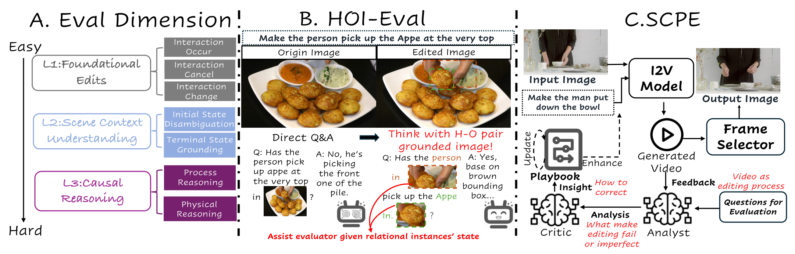

# Taming I2V models for Image HOI Editing: A Cognitive Benchmark and Agentic Self-Correcting Framework

**Coming Soon.**

Current image editing methods excels at static attributes but fails at complex Human-Object Interactions (HOI), a critical challenge unaddressed by existing benchmarks that conflate HOI with static attributes, relying on global metrics incapable of simultaneously assessing dynamic interaction validity and entangled human-object pair preservation. Thus, we first introduce HOI-Edit, a comprehensive benchmark with three progressive cognitive levels, which features an automated metric HOI-Eval that first reliably evaluates instance-level interaction by letting VLM Q&A after thinking with images containing grounded Human-Object pair. Considering the task's essence of remodeling dynamic relationships, we benchmark Image-to-Video (I2V) models, finding them inherently suited for dynamic editing due to their temporal generation capabilities. Crucially, beyond superior performance, this capability provides a "replay of the failure process", offering unique diagnosability into why errors occur. We thus propose SCPE (Self-Correcting Process Editing), a novel, agentic self-correcting framework that constrains the generation of I2V models through iteratively refined prompts, enabling the generated videos to more accurately present the target HOI. Extracted frames from these videos are the final editing results. On HOI-Edit, SCPE achieves performance competitive with state-of-the-art (SOTA) editing models like Nano Banana on interaction.

  

  <a href="assets/fig1_v3.pdf">Figure (PDF)</a>

