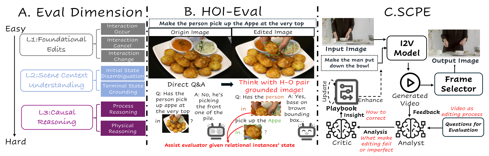

# Taming I2V models for Image HOI Editing: A Cognitive Benchmark and Agentic Self-Correcting Framework

<!-- Replace the # targets below when the public resources are available. -->
[](https://arxiv.org/abs/2606.19073)
[](https://andyplus1.github.io/HOIEdit_page/)
[](https://pan.baidu.com/s/1XBGmKSqbz_j8q2Tjkxaghg)
[](https://www.youtube.com/watch?v=Wr355j98Cdo)

This repository is the official PyTorch implementation of the paper
**Taming I2V models for Image HOI Editing: A Cognitive Benchmark and Agentic Self-Correcting Framework**.


Current image editing methods excels at static attributes but fails at complex Human-Object Interactions (HOI), a critical challenge unaddressed by existing benchmarks that conflate HOI with static attributes, relying on global metrics incapable of simultaneously assessing dynamic interaction validity and entangled human-object pair preservation. Thus, we first introduce HOI-Edit, a comprehensive benchmark with three progressive cognitive levels, which features an automated metric HOI-Eval that first reliably evaluates instance-level interaction by letting VLM Q&A after thinking with images containing grounded Human-Object pair. Considering the task's essence of remodeling dynamic relationships, we benchmark Image-to-Video (I2V) models, finding them inherently suited for dynamic editing due to their temporal generation capabilities. Crucially, beyond superior performance, this capability provides a "replay of the failure process", offering unique diagnosability into why errors occur. We thus propose SCPE (Self-Correcting Process Editing), a novel, agentic self-correcting framework that constrains the generation of I2V models through iteratively refined prompts, enabling the generated videos to more accurately present the target HOI. Extracted frames from these videos are the final editing results. On HOI-Edit, SCPE achieves performance competitive with state-of-the-art (SOTA) editing models like Nano Banana on interaction.

<p align="center">
  
</p>

<p align="center">
  <a href="assets/HOIEdit_ICML_2026_CR_submission.pdf">Paper (PDF)</a> |
  <a href="assets/fig1_v3.pdf">Figure (PDF)</a>
</p>

## Code Release

This repository contains code and annotation JSON files for **HOI-Edit**, **HOI-Eval**, and **SCPE**. Large assets are hosted separately. See [ASSETS.md](ASSETS.md).

## Download Assets

Download `hoi_edit_assets_v7.tar.gz` from [ASSETS.md](ASSETS.md), then extract it at the repository root:

```bash
tar -xzf hoi_edit_assets_v7.tar.gz
```

Expected layout:

```text
data/
├── collected_annotations_bboxes_v7_L1L2_questions_scoring_final.json
├── collected_annotations_bboxes_v7_L3_questions_scoring_final.json
├── data_v7_L12/
└── data_v7_L3/

weights/
├── groundingdino_swint_ogc.pth
└── sam2.1_hiera_large.pt
```

## SCPE Setup

SCPE stands for **Self-Correcting Process Editing** and lives in [scpe/](scpe). It uses Gemini for Playbook learning, inference, and frame selection. It can use either DashScope Wan2.2 I2V or a local Wan2.2 I2V A14B checkout for video generation.

```bash
cd scpe
./setup_env.sh
cp env.example env.local
```

Edit `scpe/env.local`:

```bash
export GEMINI_API_KEY="your-gemini-api-key"
export DASHSCOPE_API_KEY="your-dashscope-api-key"  # DashScope backend only
export ACE_LANG="cn"
export DATA_ROOT="/path/to/data"
export WAN22_REPO="/path/to/Wan2.2"
export WAN22_CKPT_DIR="/path/to/Wan2.2-I2V-A14B"
```

## SCPE Run

1. Original Wan2.2 generation:

```bash
cd scpe
source env.local
./run_minimal.sh wan22
```

2. Learn one-round Playbook with SCPE:

```bash
./run_minimal.sh learn
```

3. Use the learned Playbook for prompt enhancement and frame selection:

```bash
./run_minimal.sh enhance
./run_minimal.sh wan22
./run_minimal.sh qa2
```

For local Wan2.2:

```bash
WAN22_BACKEND=local ./run_minimal.sh wan22
```

## HOI-Eval

Place edited frames at:

```text
data/<model_name>_frames/L1L2/
data/<model_name>_frames/L3/
```

Then run:

```bash
MODELS=<model_name> bash run_eval.sh
```
